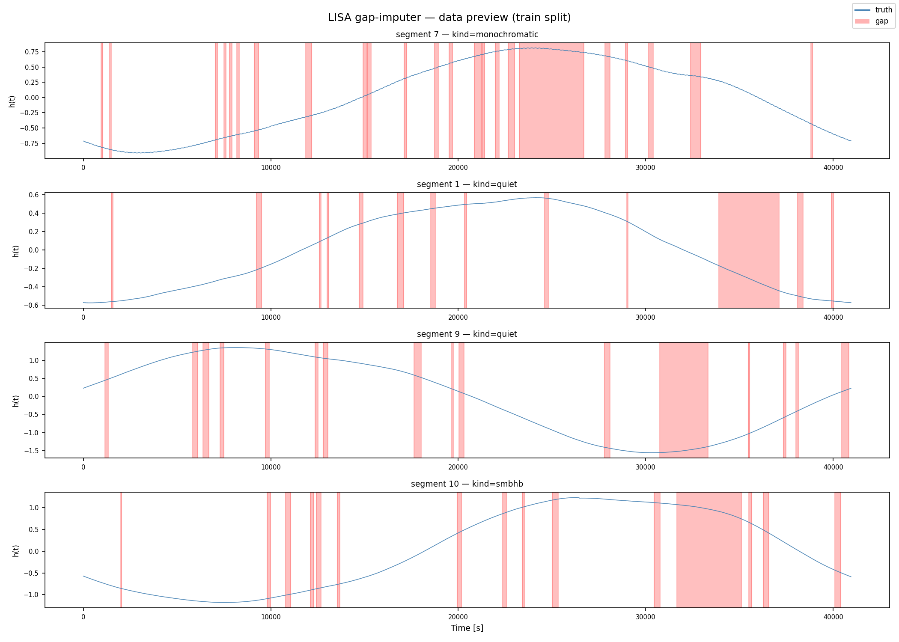
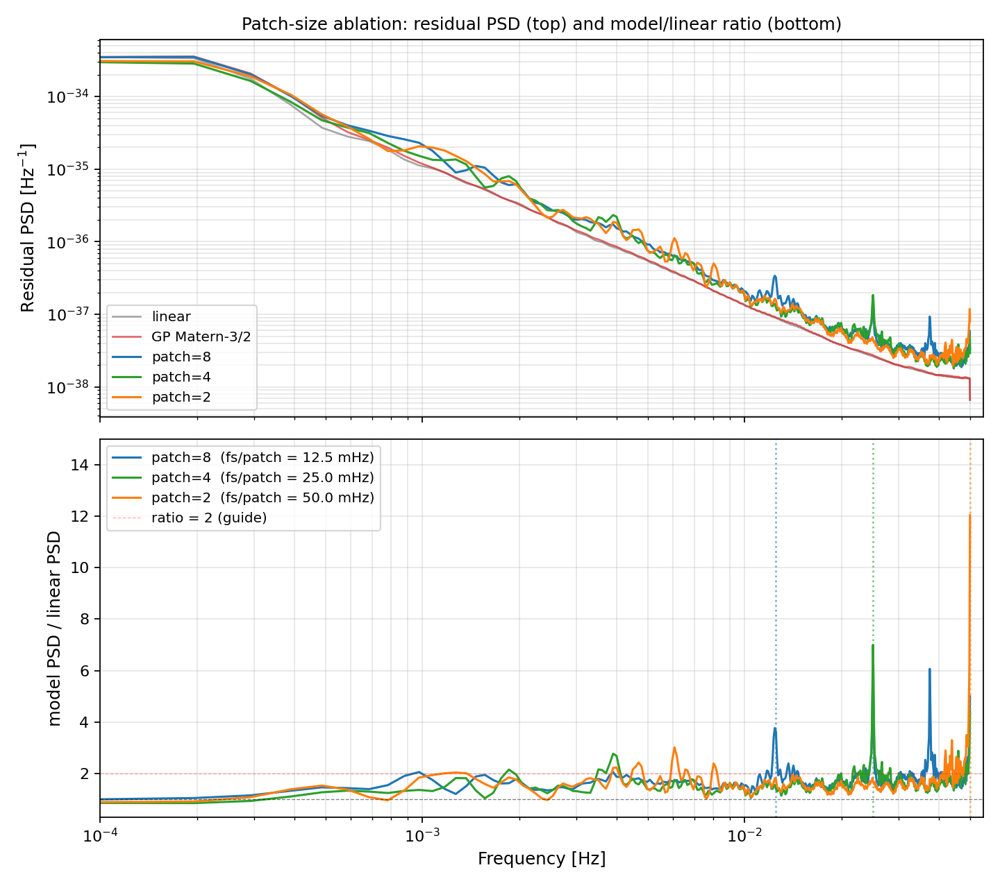
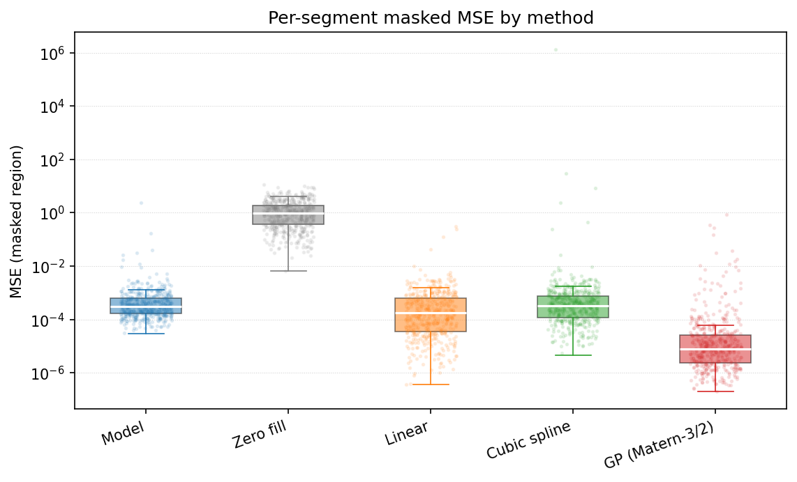

# LISA gap imputer

A transformer-based gap imputer for simulated LISA strain, benchmarked
against classical interpolation and a Gaussian-process baseline. This is a
learning / portfolio project, not a research contribution.

## Motivation

LISA will have duty-cycle gaps. Some are planned (antenna repointing,
orbit corrections), some are random (micrometeorite hits). Downstream
analyses like matched filtering and parameter estimation care a lot about
how those gaps get filled, and the right thing to do is not obvious for
coloured, non-white noise.

Classical interpolation handles short gaps well but ignores the noise
correlation structure. Gaussian processes model the correlation structure
explicitly, but they scale as O(N³) in the number of observed points, so
they're expensive on long segments. Deep-learning imputers are supposed to
learn the noise statistics and the injected signals together, with the
trade-off that you pay a big upfront training cost for cheap inference
later.

I wanted to set up this three-way comparison for myself on a clean
synthetic setup, partly to understand the problem and partly as a
reproducible toy benchmark. The comparison is the point. I'm not claiming
state-of-the-art imputation.

### Prior work

LISA gap treatment is already a well-established research topic. Key
references:

- Baghi et al. (2019), *Phys. Rev. D* **100**, 022003,
  DOI [10.1103/PhysRevD.100.022003](https://doi.org/10.1103/PhysRevD.100.022003).
  The foundational Bayesian data-augmentation paper for LISA gaps.
- Blelly, Bobin & Moutarde (2022), *MNRAS* **509**, 5902,
  DOI [10.1093/mnras/stab3314](https://doi.org/10.1093/mnras/stab3314).
  Sparse inpainting for galactic-binary signals.
- Dey et al. (2021), *Phys. Rev. D* **104**, 044035,
  DOI [10.1103/PhysRevD.104.044035](https://doi.org/10.1103/PhysRevD.104.044035).
  Quantifies the effect of gaps on MBHB parameter estimation.
- Burke et al. (2025), preprint
  [arXiv:2502.17426](https://arxiv.org/abs/2502.17426).
  Derives the correct gapped-data likelihood. This is the conceptual
  ceiling for the whole problem: rather than imputing a single best
  guess for the missing samples and doing inference on that, you
  marginalize over the missing data in the likelihood itself. An
  imputation method like mine produces a point estimate where the
  likelihood framework produces a distribution. The Mao, Lee & Edwards
  2025 preprint (below) takes this seriously and skips imputation
  entirely in favour of simulation-based inference directly on the
  gapped data, on the argument that a two-stage reconstruct-then-infer
  pipeline bakes in the imputation bias.
- **Mao, Lee & Edwards (2025), *Phys. Rev. D* **111**, 024067,
  DOI [10.1103/PhysRevD.111.024067](https://doi.org/10.1103/PhysRevD.111.024067).**
  Stacked DCAE+BiGRU imputer for LISA gaps, >99.97% waveform overlap on
  MBHB injections. This is the closest paper to what I'm doing here, and
  my toy transformer does substantially worse than their method. Not
  replicating it. Not trying to compete with it.
- Mao, Lee & Edwards (2025), preprint
  [arXiv:2512.18290](https://arxiv.org/abs/2512.18290).
  Follow-up that argues you should skip imputation entirely and do
  simulation-based inference directly on gapped data.

I do not run on the LDC Spritz benchmark
([arXiv:2204.12142](https://arxiv.org/abs/2204.12142)). Spritz is the
realistic test-bench for this problem, but setting it up properly is
outside the scope of this project.

## Quick start

### Install

```bash
# From the repository root
pip install -e .

# The PN waveform dependency
pip install git+https://github.com/WizardEternal/smbhb-inspiral.git
```

### Generate preview data

```bash
python scripts/01_generate_data.py --out-dir runs/preview
```

Writes a small HDF5 file and a preview plot to `runs/preview/`.

### Train

```bash
python scripts/02_train.py --out-dir runs/v1 --epochs 25 --n-train 8000 --n-val 1500
```

Writes `best.pt`, `last.pt`, and `history.json` to `runs/v1/`. Roughly
1.5 min/epoch on an RTX 4050 Laptop GPU, so about 70 min total for 25
epochs.

### Evaluate baselines only

```bash
python scripts/03_evaluate_baselines.py \
    --checkpoint runs/v1/best.pt \
    --out runs/v1/eval/baseline_results.pkl
```

You need to pass a checkpoint even when only running baselines, because
the evaluation pipeline reads the normalisation `scale` out of it.

### Full evaluation and plots

```bash
python scripts/04_evaluate_model.py \
    --checkpoint runs/v1/best.pt \
    --out-dir runs/v1/eval
```

Writes `results.pkl` and a `figures/` sub-directory.

## Methodology

### Noise model

Stationary Gaussian noise, coloured by the analytic LISA sensitivity curve
from Robson, Cornish & Liu (2019), CQG 36, 105011. I evaluate the
one-sided PSD S_n(f), take its square root for the ASD, multiply white
Gaussian noise by sqrt(S_n(f) / (2 df)) in the frequency domain, and
inverse-FFT back. Frequencies below 1e-5 Hz are high-passed to kill DC
drift.

No Galactic-binary confusion foreground, so the 3 mHz sensitivity trough
sits at the analytic-fit level instead of the mission-realistic level.
That's a known limitation (see below).

Noise code: [`src/lisa_gap_imputer/noise.py`](src/lisa_gap_imputer/noise.py).

### Signal injection

Each training segment is drawn from one of three classes, with
probabilities 0.5 / 0.2 / 0.3:

- **SMBHB chirps.** Post-Newtonian inspiral waveforms from the sibling
  `smbhb-inspiral` package. Total mass log-uniform in [1e5, 1e7] M_sun,
  mass ratio q in [0.1, 1], luminosity distance in [500, 10000] Mpc,
  inclination uniform in [0, pi]. The total-mass cap is below the 1e10
  M_sun ceiling of the waveform package because the ISCO frequency scales
  as 1/M: 1e7 M_sun systems merge at about 0.4 mHz, right at the low edge
  of LISA's sensitive band, and systems above 1e8 M_sun merge below the
  band entirely. Including those would give the model slow-evolving
  quasi-monochromatic inspirals rather than the chirping signal morphology
  the gap imputer needs to learn.
- **Monochromatic galactic binaries.** Sinusoids with frequency drawn
  uniformly across the LISA band and amplitude drawn from a fixed prior.
- **Quiet segments.** Pure noise, no astrophysical signal. Without these
  the model overfits to "always see a signal" and the noise-only
  reconstruction gets worse.

Signal code: [`src/lisa_gap_imputer/signals.py`](src/lisa_gap_imputer/signals.py).

### Gap model

Each segment gets two kinds of gaps, applied together:

- **Periodic repointing block.** One contiguous gap covering 5–10 % of the
  segment length, placed at a uniformly random start. Represents
  scheduled antenna-repointing downtime.
- **Stochastic micrometeorite gaps.** A Poisson-distributed number of
  short gaps (mean rate about 4 per 1000 samples), each with a log-normal
  duration (log_mean = -5.5, log_std = 0.7). Durations clipped to
  [1, N/20] so the worst stochastic gap can't eat the segment.

The binary mask (1 = observed, 0 = gap) is built by the gap sampler in
[`src/lisa_gap_imputer/masks.py`](src/lisa_gap_imputer/masks.py) and goes
into both the model input and the loss.



### Model

A compact convolutional-patch transformer (CCT-style):

1. **Conv-stem patch tokeniser.** One `Conv1d` with kernel, stride, and
   output channels all equal to `patch_size = 8`. Input length L becomes
   T = L / patch_size tokens of dimension `d_model = 128`. Two input
   channels: the masked strain (gaps zeroed) and the binary mask.
2. **Positional encoding.** Fixed sinusoidal, sized for
   `max_len = 8192` tokens.
3. **Transformer encoder.** 5 pre-LayerNorm encoder layers, 4 heads each,
   `dim_feedforward = 512`, GELU, `dropout = 0.1`, `batch_first = True`.
4. **Linear unpatchify.** `Linear(d_model, patch_size)` projects each
   token back to a patch of strain values, then `(B, T, patch_size)` gets
   reshaped to `(B, L)` in C-contiguous row-major order so time stays
   in order.

About 995k parameters. Fits on a 6 GB RTX 4050 Laptop at
`batch_size = 32`, `seq_len = 4096`.

Model code: [`src/lisa_gap_imputer/model.py`](src/lisa_gap_imputer/model.py).

### Training

| Hyperparameter | Value |
|---|---|
| Optimiser | AdamW |
| Learning rate | 3e-4 |
| Weight decay | 1e-4 |
| Betas | (0.9, 0.95) |
| Scheduler | OneCycleLR, cosine annealing, pct_start=0.1 |
| Precision | AMP float16 on CUDA |
| Gradient clipping | 1.0 (global norm) |
| Early stopping | patience=7 on val masked-MSE |

Loss: `L = masked_MSE + 0.1 * observed_MSE`. The small observed-MSE term
forces the network to fit observed positions consistently. Without it,
training collapses (see "Stuff that went sideways" below).

Training code: [`src/lisa_gap_imputer/train.py`](src/lisa_gap_imputer/train.py).

### Baselines

| Baseline | Method |
|---|---|
| `zero` | Fill gaps with 0 |
| `linear` | Piecewise linear interpolation across each gap |
| `cubic_spline` | Not-a-knot cubic spline |
| `gp_matern32` | Gaussian process with Matern-3/2 kernel, subsampled to 400 observed points per segment for speed |

Baseline code: [`src/lisa_gap_imputer/baselines.py`](src/lisa_gap_imputer/baselines.py).

### Evaluation

Metrics are in [`src/lisa_gap_imputer/evaluate.py`](src/lisa_gap_imputer/evaluate.py):

- **MSE and MAE per gap**, split by gap kind (periodic vs stochastic) and
  binned by duration in samples.
- **Residual PSD.** Welch PSD of `(reconstructed - truth)` averaged across
  the test set, overlaid on the theoretical S_n(f). A good imputer sits
  well below S_n(f) across the band.
- **Matched-filter SNR recovery.** On SMBHB segments, I compute the
  matched-filter SNR of each reconstruction against the truth waveform as
  the template, using the analytic PSD for noise weighting. The recovery
  fraction `SNR_reconstructed / SNR_truth` is the summary number. (This
  metric turns out to be uninformative at this gap fraction. See the
  Results section.)

## Key limitations

- **Stationary Gaussian noise only.** No glitches, no slow drifts, no
  non-Gaussian tails. Real LISA data will be non-stationary and will
  contain instrumental artefacts. This is the single biggest caveat. All
  methods here are affected equally, but the comparison does not
  generalise directly to mission data.
- **No Galactic confusion foreground.** The 3 mHz sensitivity trough is
  fixed at the Robson+19 analytic level. Real early-mission data will
  include unresolved galactic binaries and the effective noise floor in
  that band will be higher.
- **One channel, not LISA TDI channels.** LISA will produce three
  time-delay interferometry streams with correlated noise. This model
  operates on a single channel and ignores cross-channel structure.
- **Fixed segment length and cadence.** `seq_len = 4096` at `fs = 0.1 Hz`
  covers roughly 11 hours. Extending to multi-day segments with full
  attention scales quadratically and won't fit on 6 GB at this
  architecture.
- **Single-GPU, 6 GB VRAM.** `d_model > 256` doesn't fit at
  `batch_size = 32` on my laptop. Hardware constraint, not a design
  choice.
- **Exploratory benchmark, not SOTA.** I don't compare against the
  published neural imputers for this problem. The closest one, the
  DCAE+BiGRU of Mao, Lee & Edwards (2025),
  DOI [10.1103/PhysRevD.111.024067](https://doi.org/10.1103/PhysRevD.111.024067),
  does substantially better than my toy transformer. The goal here was to
  reproduce and understand the classical problem for myself, not to beat
  the literature.

## Results

Run configuration:

- 8 000 training segments, 1 500 validation, 1 000 held-out test. Disjoint
  `master_seed` values per split so no parameter draw leaks across splits.
- 25 epochs. AdamW + OneCycleLR (lr_max = 3e-4). AMP float16. Batch size
  32. About 995 k parameters.
- On an RTX 4050 Laptop (6 GB): ~70 min to train, ~23 min to evaluate.
  The Gaussian-process baseline dominates the evaluation time.
- Best checkpoint at epoch 25, `val_masked_loss = 2.19e-3`. Zero-fill
  gives a val_masked_loss of about 1.0 by construction, since the data
  is normalised to unit variance.

### Headline table

Per-segment MSE on masked positions only, in normalised strain units
(target variance = 1.0). Lower is better.

| method          | median MSE | IQR MSE    | p90 MSE    | mean MSE   |
|-----------------|-----------:|-----------:|-----------:|-----------:|
| zero-fill       |   9.50e-01 |   1.52e+00 |   3.32e+00 |   1.43e+00 |
| cubic spline    |   3.20e-04 |   6.51e-04 |   1.76e-03 |   1.35e+03 |
| model (ours)    |   3.12e-04 |   4.69e-04 |   1.38e-03 |   5.15e-03 |
| linear          |   1.78e-04 |   5.94e-04 |   1.65e-03 |   4.55e-03 |
| **GP Matern-3/2** | **7.78e-06** | **2.36e-05** | **1.12e-04** | **4.84e-03** |

The GP beats everything else by one to two orders of magnitude on the
median. Zero-fill sits at the noise-variance floor, which is what you'd
expect (test data is normalised to unit variance, so mean-predicting gets
MSE ≈ 1).

Cubic spline's median is competitive, but its mean is blown up by a
handful of catastrophic outliers: 5 of 1000 test segments have MSE ≥ 1.0,
one of them at 1.35e+6. These are edge-gap cases where the not-a-knot
polynomial extrapolates outside the convex hull of the observed samples
and diverges. That's the single visible 10⁶ point on `mse_boxplot.png`.

### What changes with gap duration

Median per-gap MSE by gap kind and duration bin (samples):

| gap kind & bin        |  n    | zero     | linear   | cubic spline | model    | GP Matern-3/2 |
|-----------------------|------:|---------:|---------:|-------------:|---------:|---------------:|
| stochastic [1, 8)     | 1 735 | 6.77e-01 | 1.39e-07 |     5.90e-07 | 1.22e-04 |   1.41e-07 |
| stochastic [8, 32)    |11 587 | 6.69e-01 | 1.60e-07 |     2.73e-06 | 1.15e-04 |   1.60e-07 |
| stochastic [32, 128)  | 3 117 | 6.47e-01 | 5.13e-07 |     1.58e-05 | 1.23e-04 |   2.75e-07 |
| stochastic [128, 512) |    25 | 1.35e+00 | 3.71e-05 |     2.37e-04 | 4.77e-04 |   5.21e-06 |
| periodic  [128, 512)  | 1 000 | 6.34e-01 | 3.54e-04 |     6.07e-04 | 3.34e-04 |   1.31e-05 |

A few things stand out:

- On short stochastic gaps, linear and GP both land near 1.4e-7. Both are
  just exploiting the strong short-range autocorrelation of the coloured
  noise. GP has no extra lever at gaps shorter than 32 samples.
- The model's per-gap MSE is essentially flat at 1.1–1.2e-4 across the
  three stochastic bins. Linear and GP drop three orders of magnitude
  as gaps shrink. The model doesn't. I initially guessed this was the
  patch-8 tokeniser acting as a bottleneck. The patch-size ablation
  below partly supports that: shrinking the patch to 4 or 2 does bring
  short-gap MSE down from 1.22e-4 to ~1.00e-4, a modest gain. But
  that's still four orders of magnitude worse than linear's 1.4e-7,
  so the tokeniser is only a small contributor. The main story is
  probably that the model has learned a global prior over the
  coloured-noise PSD and applies it everywhere, rather than a local
  interpolation rule that cheap methods get for free.
- On the long periodic gaps (the 5–10 % repointing blocks), cubic spline
  and linear both start to struggle, and this is the only bin where the
  neural model slightly edges out linear (3.34e-4 vs 3.54e-4). This is
  the regime where a learned prior is supposed to pay off, and it's
  starting to, though the model is still about two orders of magnitude
  behind the GP.

### By signal kind

| method          | quiet    | smbhb    | monochromatic |
|-----------------|---------:|---------:|---------------:|
| zero            | 8.98e-01 | 9.44e-01 |      1.02e+00 |
| linear          | 1.71e-04 | 1.86e-04 |      1.79e-04 |
| cubic spline    | 2.89e-04 | 3.63e-04 |      2.82e-04 |
| model (ours)    | 2.45e-04 | 3.82e-04 |      2.39e-04 |
| GP Matern-3/2   | 5.08e-06 | 1.22e-05 |      6.92e-06 |

SMBHB segments are hardest for every method. The chirp amplitude is
non-stationary, which violates the GP's stationarity assumption, and it
pulls the learned model off its "interpolate through noise" regime. The
ranking across methods stays the same.

### Why does the model lose to linear interpolation?

Three likely contributors, roughly in order of how likely I think they
are:

1. **Capacity and data-scale, not epoch count.** val_masked_loss
   plateaued at 2.19e-3 over the last three epochs with the OneCycle LR
   already annealed to ~1e-9. The optimiser has converged on this
   architecture and this dataset. But 8 000 training segments is not much
   for a ~1M-parameter transformer, and the train_masked_loss bottomed
   out at 2.7e-3 (very close to val), which is what you'd see from a
   model that's saturated against its effective capacity on the data it
   has. More data and a wider model, not just more epochs of the same
   schedule, is probably what this needs.
2. **Patch tokeniser has two separate effects, good and bad.** A Conv1d
   with kernel = stride = patch_size = 8 collapses each 8-sample window
   into a 128-dim token with a learned linear projection and no
   residual path for the raw samples. The ablation below shows this
   cleanly splits into two different stories. On the good side,
   shrinking patch=8 to patch=4 improves median masked MSE by ~15 %
   (3.12e-4 → 2.65e-4), because more tokens gives the attention stack
   more low-frequency expressiveness. On the bad side, shrinking the
   patch makes the residual-PSD cadence peak *larger*, not smaller:
   each model imprints a cadence-locked peak at its own fs/patch
   (2.8× → 4.5× → 7× for p=8/4/2), and p=2's cadence peak sits at
   Nyquist with a 12× excess. Patch=4 is the MSE sweet spot but still
   carries a visible spectral artefact. The right fix is not "smaller
   patch" but rather "no patch" (dilated conv front end) or a hybrid
   head that keeps raw samples alongside the tokeniser.
3. **The GP is the ceiling, in this regime.** The data-generating
   process is a stationary Gaussian with known PSD plus a small
   deterministic signal. On that problem the GP conditional mean *under
   the true kernel* is provably the MMSE estimator at the gap positions,
   so no transformer can asymptotically beat a correctly-specified GP
   here. The Matern-3/2 GP I use is a kernel approximation to the true
   LISA PSD, not the truth, but it's close enough that the gap between
   it and the Bayes ceiling is small. That's why the model placing third
   is not a surprise and not really the interesting result. The real
   research question is what happens when you break the stationary-
   Gaussian assumption: Edwards et al. 2020 (DOI
   10.1103/PhysRevD.102.084062) document LISA noise non-stationarity,
   real data has glitches and instrumental artefacts, and those are
   exactly the regimes where a GP loses its optimality guarantee. Those
   are the regimes where a learned imputer is worth building.

### Residual PSD

`residual_psd.png` shows the Welch PSD of `(truth - reconstruction)`
averaged across the test set, overlaid on the analytic LISA S_n(f).
Three things worth pointing out:

1. Zero-fill and cubic spline sit 2–4 orders of magnitude above the
   other methods at low frequency. For zero-fill this is just the noise
   variance leaking into the spectrum. For cubic spline the low-f bump
   is dragged up by the handful of catastrophic extrapolation outliers.
2. Linear, GP, and the model track each other closely below about 2
   mHz. All three residuals sit roughly two orders of magnitude above
   the analytical S_n floor across the band.
3. The model shows a visible high-frequency excess above about 3 mHz
   that linear and GP don't have. My initial guess was patch-boundary
   leakage at fs/patch = 12.5 mHz (the token cadence for patch=8). To
   test it properly I retrained with patch=4 and patch=2 and looked at
   the residual-PSD ratio at each model's own cadence. The result
   supports the hypothesis: see the Patch-size ablation section below
   for the clean cadence-locked peak at each model's fs/patch.

### Patch-size ablation

Rationale: the main model (patch=8) shows an HF excess in the residual
PSD that linear and GP don't have. My first guess was patch-boundary
leakage at the token cadence fs/patch (12.5 mHz for patch=8). To test
that I retrained the same architecture with patch=4 and patch=2,
otherwise identical (25 epochs, 8000 training segments, same seeds),
and ran the full evaluation on the same 1000-segment held-out test
set. The baseline medians (zero, linear, cubic, GP) are bit-identical
across all three evaluations, confirming the test set is the same.

**Headline numbers:**

| patch | val_mask (best) | median masked MSE | IQR MSE | ratio at own fs/patch | peak ratio across band |
|------:|----------------:|------------------:|--------:|----------------------:|----------------------:|
| 8     | 2.19e-3         | 3.12e-4           | 4.69e-4 | 2.8× at 12.5 mHz      | 6.1× at 37.5 mHz (3rd harmonic)|
| **4** | **2.13e-3**     | **2.65e-4**       | 3.70e-4 | **4.5× at 25.0 mHz**  | 7.0× at 25 mHz (fundamental) |
| 2     | 2.25e-3         | 2.74e-4           | 3.64e-4 | **7.0× at 50.0 mHz**  | 12.0× at 50 mHz (fundamental, = Nyquist) |

("Ratio at own fs/patch" is the model/linear residual-PSD ratio averaged
over a 7-bin window centred at fs/patch. "Peak ratio" is the maximum
local ratio anywhere in the band.)



The bottom panel is the diagnostic one. Each model's ratio curve has a
clear spectral peak right at its own fs/patch cadence (blue at 12.5
mHz, green at 25 mHz, orange at 50 mHz), while staying near 1× at the
other two patches' cadences. This is the cadence-locked signature the
patch-boundary hypothesis predicts. A single-number "HF-excess onset"
threshold metric (first frequency where the ratio exceeds 2×) gives a
misleading picture here because it's noise-sensitive and obscures the
narrow cadence peak; the cadence-locked peaks in the ratio panel are
the right way to read the effect.

What the ablation actually shows:

- **Patch-boundary leakage is real and spectrally localised.** Each
  model puts its worst-case residual power at exactly its own token
  cadence. Off-cadence excess is small (p=4 at 12.5 mHz is only 1.4×
  over linear; p=2 at 12.5 mHz is 1.6×). The fundamental at fs/patch
  dominates; p=8 also shows a visible 3rd-harmonic peak at 37.5 mHz.
- **Smaller patches make the cadence peak larger, not smaller.** Peak
  ratios go 2.8× → 4.5× → 7× at each model's own cadence; the overall
  band-peak goes 6× → 7× → 12×. This is consistent with finer patches
  producing more boundary sites per segment, concentrating more
  step-artefact energy into a tighter spectral line.
- **Patch=4 still wins on median masked MSE** despite having a larger
  cadence peak than patch=8 (15 % lower median MSE vs v1). The reason
  is that the cadence peak sits at high frequency where LISA noise
  power is small; it contributes little to the time-domain MSE. The
  MSE improvement from patch=8 → patch=4 comes from somewhere else,
  probably better expressiveness of the 1024-token vs 512-token
  attention stack in the low-frequency band where most of the noise
  energy actually lives.
- **Patch=2 gives up those MSE gains.** Doubling token count to 2048
  seems to make the attention stack harder to train at the fixed
  compute budget I used, and the cadence artefact is worst of all three.

**What I actually learned.** The right fix for the HF artefact is not
"smaller patch" (that's worse), and the right fix for MSE is not
"smaller patch" either (p=2 regresses). A cleaner next step would be a
hybrid model that keeps a residual path of raw samples around the patch
tokeniser, or an architecture without hard patch boundaries at all (a
dilated-conv front end, for example). I didn't run that. For a portfolio
study this is enough: there's a clean positive result (cadence-locked
leakage confirmed spectrally), a clean negative result (shrinking the
patch doesn't fix it and may make it worse), and a concrete direction
for follow-up.

The patch=8 checkpoint (`runs/v1/best.pt`) is the one the headline
results tables above refer to. The patch=4 and patch=2 checkpoints are
in `runs/v1_p4/` and `runs/v1_p2/` for anyone reproducing the ablation.

### Matched-filter SNR recovery

All observed-preserving methods (model, linear, cubic spline, GP) and
even zero-fill land between 0.991 and 0.997 on the SMBHB SNR-recovery
metric. The problem is not the experiment, it's the metric. About 90 %
of each segment's samples are observed and held constant across every
method, so the matched-filter inner product against a truth-as-template
is dominated by the observed 90 % regardless of what happens in the
10 % gap region. The metric is insensitive to gap-region differences by
construction, which is exactly the thing you want to discriminate on.

This is a known weakness of raw SNR ratios for LISA gap work. The
published protocol in Dey et al. (2021,
DOI 10.1103/PhysRevD.104.044035) and Mao, Lee & Edwards (2025,
DOI 10.1103/PhysRevD.111.024067) uses waveform overlap against the
noiseless signal-only template plus parameter-bias relative to the
Fisher 1-sigma prediction, neither of which has this construction
problem. A cleaner follow-up here would swap the template from truth =
signal + noise to the noiseless SMBHB chirp. I use the simpler
truth-as-template version for implementation reasons discussed in
`src/lisa_gap_imputer/evaluate.py`.

### Plots



Figures below are a committed snapshot of the run that produced the
numbers above (from `runs/v1/eval/figures/` at evaluation time). To
regenerate them run `python scripts/04_evaluate_model.py` as above.

| File | Content |
|---|---|
| [`mse_boxplot.png`](assets/mse_boxplot.png) | Per-segment masked MSE, log scale. Shows the GP dominance and the cubic-spline tail. |
| [`recon_mse_vs_gap_duration.png`](assets/recon_mse_vs_gap_duration.png) | Per-gap MSE vs gap duration, binned, separate panels for periodic vs stochastic. Shows where the model catches up. |
| [`residual_psd.png`](assets/residual_psd.png) | Averaged residual PSD overlaid on the theoretical Robson+19 S_n(f). |
| [`snr_recovery.png`](assets/snr_recovery.png) | Recovered SNR vs true SNR per SMBHB injection. Largely uninformative at this gap fraction. |
| [`summary_table.csv`](assets/summary_table.csv) | Raw numbers behind the headline table. |

Plotting code: [`src/lisa_gap_imputer/plotting.py`](src/lisa_gap_imputer/plotting.py).

## Stuff that went sideways

A few engineering decisions that took real thought. Worth knowing if
you're reading the code.

**RNG hygiene.** Per-index `SeedSequence.spawn()` is stateful. You can't
cache spawned children and replay them in arbitrary order from a map-style
dataloader, because the spawn counter advances with every call. The
dataset instead builds a compound seed `SeedSequence([master_seed, i])`
fresh on every `__getitem__` and then calls `.spawn(3)` once for the
three sub-seeds (noise, signal, gap). This makes `dataset[i]`
bit-for-bit reproducible regardless of access order, worker count, or
shuffle state.

**Amplitude normalisation.** Raw LISA strain is O(1e-21). If you hand
that to float32 gradients straight, underflow and precision loss are
routine. I calibrate a single global scale from 64 noise realisations
drawn against the training seed, and propagate the same scale to the
validation and test splits via `build_splits`. Per-split scales would
introduce finite-sample drift across splits and a small but real bias in
the loss numbers when you compare methods.

**Patch reshape ordering.** The conv-stem and unpatchify path relies on
C-contiguous row-major memory layout so that `(B, T, P).reshape(B, L)`
walks left-to-right in time. I verified this explicitly. A transposition
bug here would produce residuals that still look like plausible coloured
noise and a loss that doesn't obviously scream, but the time series is
silently shuffled.

**GP cubic scaling.** Full GP inference on 4096 observed points is O(N³)
and takes over a minute per segment. Stratified subsampling to 400
observed points brings that down to about a second per segment with
negligible accuracy loss for this task, where you only want the
conditional mean at the gap positions.

**Combined loss weighting.** Training with masked-MSE alone collapses
early: the model learns to output zero everywhere, because the masked
input channel is already zero at gap positions and the observed channel
provides no gradient signal there. Adding `0.1 * observed_MSE` forces
the network to fit observed positions and build a consistent internal
representation of the noise statistics, which then generalises to the
imputed positions.

## Repro checklist

```
- Python 3.11+
- PyTorch >= 2.2 with CUDA 12.x (CPU works but training is ~20x slower)
- smbhb-inspiral: https://github.com/WizardEternal/smbhb-inspiral
- ~1.5 min/epoch on an RTX 4050 Laptop GPU at n_train=8000, batch_size=32, seq_len=4096
  (scales roughly linearly in n_train)
- Results are deterministic modulo torch.backends.cudnn.benchmark=True and AMP
  non-determinism. For exact reproducibility, set both to False before evaluation.
```

## Citations

### Noise model and sensitivity

- Robson, T., Cornish, N. J., Liu, C. (2019). The construction and use of
  LISA sensitivity curves. *Classical and Quantum Gravity* **36**, 105011.
  DOI: [10.1088/1361-6382/ab1101](https://doi.org/10.1088/1361-6382/ab1101)
- Babak, S., Hewitson, M., Petiteau, A. (2021). LISA Sensitivity and SNR
  Calculations. LISA Consortium Technical Note LISA-LCST-SGS-TN-001.
  [arXiv:2108.01167](https://arxiv.org/abs/2108.01167)

### LISA data gaps, prior work

- Baghi, Q., Thorpe, J. I., Slutsky, J., Baker, J., Dal Canton, T.,
  Korsakova, N., Karnesis, N. (2019). Gravitational-wave parameter
  estimation with gaps in LISA: a Bayesian data augmentation method.
  *Physical Review D* **100**, 022003.
  DOI: [10.1103/PhysRevD.100.022003](https://doi.org/10.1103/PhysRevD.100.022003)
- Edwards, M. C., Maturana-Russel, P., Meyer, R., Gair, J., Korsakova, N.,
  Christensen, N. (2020). Identifying and Addressing Nonstationary LISA
  Noise. *Physical Review D* **102**, 084062.
  DOI: [10.1103/PhysRevD.102.084062](https://doi.org/10.1103/PhysRevD.102.084062)
- Dey, K., Karnesis, N., Toubiana, A., Barausse, E., Korsakova, N., Baghi,
  Q., Basak, S. (2021). Effect of data gaps on the detectability and
  parameter estimation of massive black hole binaries with LISA.
  *Physical Review D* **104**, 044035.
  DOI: [10.1103/PhysRevD.104.044035](https://doi.org/10.1103/PhysRevD.104.044035)
- Blelly, A., Bobin, J., Moutarde, H. (2022). Sparse data inpainting for
  the recovery of Galactic-binary gravitational wave signals from gapped
  data. *Monthly Notices of the Royal Astronomical Society* **509**,
  5902–5917.
  DOI: [10.1093/mnras/stab3314](https://doi.org/10.1093/mnras/stab3314)
- Mao, R., Lee, J. E., Edwards, M. C. (2025). A novel stacked hybrid
  autoencoder for imputing LISA data gaps. *Physical Review D* **111**,
  024067.
  DOI: [10.1103/PhysRevD.111.024067](https://doi.org/10.1103/PhysRevD.111.024067)
- Wang, L., Chen, H.-Y., Lyu, X., Li, E.-K., Hu, Y.-M. (2025). Dealing
  with data gaps for TianQin with massive black hole binary signal.
  *European Physical Journal C* **85**, 120.
  DOI: [10.1140/epjc/s10052-025-13810-0](https://doi.org/10.1140/epjc/s10052-025-13810-0)
- Burke, O., Marsat, S., Gair, J. R., Katz, M. L. (2025). Mind the gap:
  addressing data gaps and assessing noise mismodeling in LISA.
  Preprint, [arXiv:2502.17426](https://arxiv.org/abs/2502.17426)
- Mao, R., Lee, J. E., Edwards, M. C. (2025). Robust and scalable
  simulation-based inference for gravitational wave signals with gaps.
  Preprint, [arXiv:2512.18290](https://arxiv.org/abs/2512.18290)
- Baghi, Q. (2022). The LISA Data Challenges. Contribution to the 56th
  Rencontres de Moriond, Gravitation session.
  [arXiv:2204.12142](https://arxiv.org/abs/2204.12142)

### Architecture

- Vaswani, A., Shazeer, N., Parmar, N., Uszkoreit, J., Jones, L., Gomez,
  A. N., Kaiser, Ł., Polosukhin, I. (2017). Attention Is All You Need.
  In *Advances in Neural Information Processing Systems 30* (NeurIPS 2017),
  pp. 5998–6008.
  [NeurIPS record](https://papers.nips.cc/paper/7181-attention-is-all-you-need)
- Hassani, A., Walton, S., Shah, N., Abuduweili, A., Li, J., Shi, H.
  (2021). Escaping the Big Data Paradigm with Compact Transformers.
  Preprint, [arXiv:2104.05704](https://arxiv.org/abs/2104.05704)

## License

MIT. See [LICENSE](LICENSE).
